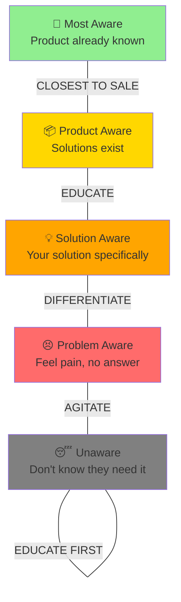
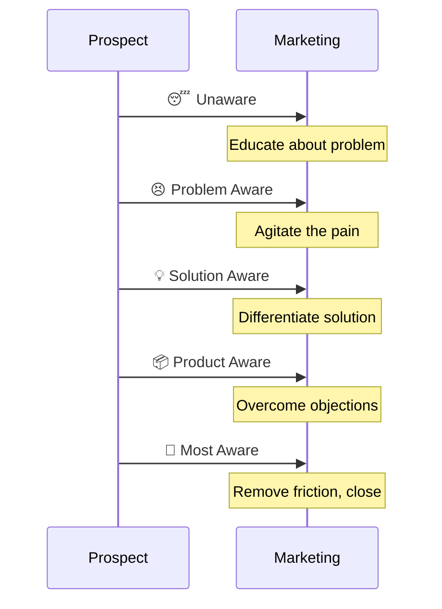
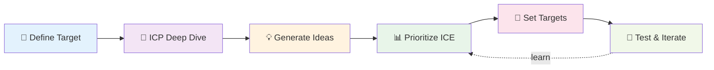
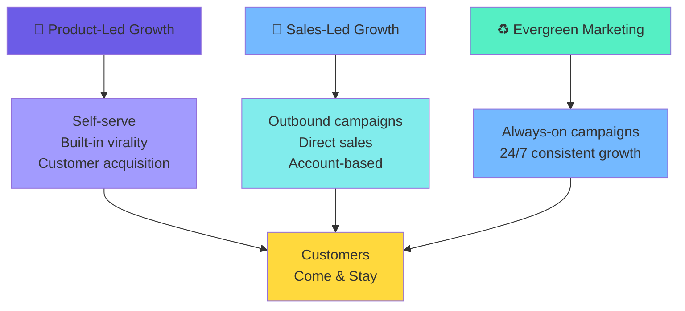
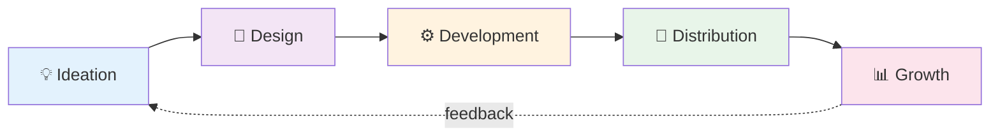
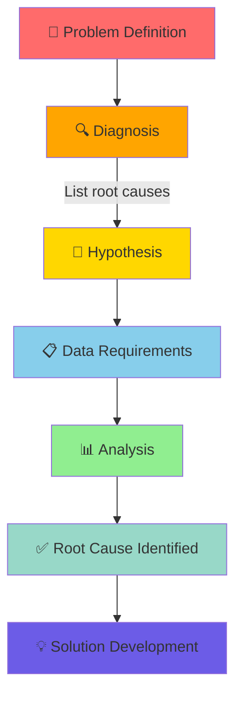
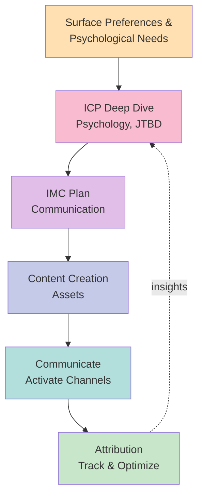
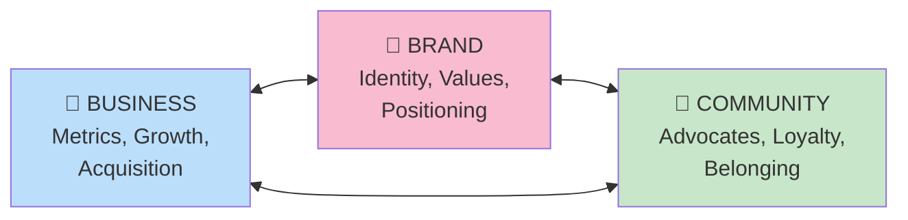

# 🎭 The Business Playbook

## Core Framework

### The Magic Formula

```
════════════════════════════════════════════════════════════════
the Pledge → the Turn → the Prestige
════════════════════════════════════════════════════════════════
```

**40% Audience** (who you're selling to)  
**40% Offer** (what you'll do for them)  
**20% Copy** (how you present it)

---

## Market Discovery

### Awareness Ladder



### The Seven Deadly Motivators
```
🔴 Gluttony   — Wanting more, abundance mindset
🔴 Greed      — What you'll gain (win)
🔴 Sloth      — Ease, convenience, less effort
🔴 Envy       — Comparing, FOMO, keeping up
🔴 Wrath      — Anger, what's holding you back (frustration)
🔴 Lust       — Desire, passion, attraction
🔴 Pride      — Identity, status, who you'll become
```

### Market Selection Criteria

| Criteria | Requirement |
|----------|-------------|
| **Problem Size** | Solve a big problem in a small way, not a small problem in a big way |
| **Money Flow** | Who will pay? (Demo/Firmo validation) |
| **Search Demand** | Have people searching for solutions |
| **Marketability** | Easy to market |
| **Viral Potential** | "Did you hear about..." (word of mouth) |
| **Growth** | Are recurring / compound adoption |

---

## Distribution Channels

### 🌐 **SEO/GEO**
Search ads (Google Ads, Bing Ads, etc.)  
Search engines / Generative engines

### 📰 **Content & Earned**
- News & PR
- Paid PR articles
- Guest-postings
- Organic content (brand, affiliates)

### 👥 **Community & Forums**
- Internet forums/communities
- Threadings
- Paid ads (Reddit ads, VOZ ads, etc.)

### 📱 **Social Media**
- Social platforms (TikTok, Instagram, Twitter, etc.)
- Paid ads (Meta ads, X ads, etc.)
- Organic content (brand, affiliates)
- UGCs (influencers, creators)
- Internal UGCs (mass accounts, clippings)

### 🛍️ **Stores & Listings**
- Store / Listing platforms
- ASO (App Store Optimization)
- Paid ads (Apple Search ads, Google Play ads, etc.)

### 🏪 **Retail & Real World**
- OOHs (Out-of-home advertising)
- Point of Sale
- IRL (In Real Life) experiences

### 📧 **Email & SMS**
- Mailbox (Email marketing)
- Transaction emails
- Newsletters
- SMS
- Transaction SMS
- Paid ads (Google ads)

### 💼 **B2B & Sponsorships**
- Sponsorships
- Strategic partnerships

---

## Buyer Journey Messaging

> "Where you are on the journey determines what message they need."



### Emotional Triggers

| Trigger | What It Taps Into |
|---------|-------------------|
| **Fear** | What you'll lose (risk avoidance) |
| **Greed** | What you'll gain (opportunity) |
| **Guilt** | What you should be doing (obligation) |
| **Anger** | What's holding you back (frustration) |
| **Pride** | Who you'll become (identity shift) |

---

## Go-to-Market Strategy (GTM)



**Framework Questions:**
- For which **problem**?
- In which **ecosystem**?
- Who is the **ICP** (Ideal Customer Profile)?

---

## Growth Models



---

## Product Development Cycle



---

## Problem-Solving Framework



---

## Marketing Planning Framework

### IMC Plan (Integrated Marketing Communication)



### Three Pillars of Business



---

## The Principle

> **Money flows where attention goes**

Attention is the currency. Get attention → Build momentum → Monetize → Reinvest.

---

*Last updated: 2026-07-08*
